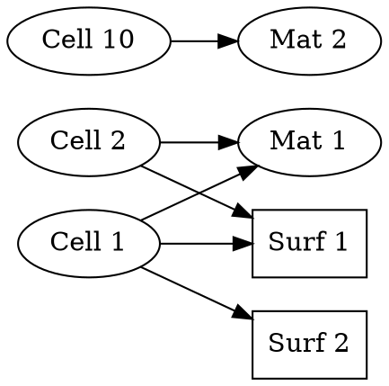

# MCNP Dependency Analysis - Algorithms and Visualization

**Version:** 2.0.0
**Skill:** mcnp-cross-reference-checker
**Purpose:** Building dependency graphs, analyzing relationships, and visualizing complex structures

---

## Overview

Dependency analysis goes beyond simple validation to provide comprehensive understanding of how entities relate in MCNP inputs. This is critical for:
- Complex geometry modifications
- Lattice structure understanding
- Impact analysis (what breaks if I change X?)
- Optimization (what can be removed?)
- Documentation (explaining input to others)

---

## Dependency Graph Structure

### Graph Data Structure

```python
dependency_graph = {
    # Forward references (source → targets)
    'cells_to_surfaces': {
        1: [1, 2, 3, 4],      # Cell 1 uses surfaces 1,2,3,4
        2: [1, 5, 6, 7],      # Cell 2 uses surfaces 1,5,6,7
        10: [10, 11, 12]      # Cell 10 uses surfaces 10,11,12
    },

    'cells_to_materials': {
        1: 1,    # Cell 1 uses material 1
        2: 1,    # Cell 2 uses material 1
        10: 2    # Cell 10 uses material 2
    },

    'cells_to_transformations': {
        50: 5,   # Cell 50 uses TR5
        60: 5,   # Cell 60 uses TR5
        70: 10   # Cell 70 uses TR10
    },

    'cells_to_universes': {
        20: {'defined': 5, 'fills': None},     # Cell 20 defines U=5
        30: {'defined': None, 'fills': 10}     # Cell 30 fills U=10
    },

    'tallies_to_cells': {
        4: [1, 2, 10],       # F4 tallies cells 1,2,10
        14: [5, 10, 15]      # F14 tallies cells 5,10,15
    },

    'tallies_to_surfaces': {
        1: [10, 20, 30],     # F1 tallies surfaces 10,20,30
        11: [5, 10, 15]      # F11 tallies surfaces 5,10,15
    },

    'fm_to_materials': {
        4: [1, 2],           # FM4 uses materials 1,2
        14: [3]              # FM14 uses material 3
    },

    # Reverse references (target → sources)
    'surfaces_used_by': {
        1: [1, 2],           # Surface 1 used by cells 1,2
        2: [1],              # Surface 2 used by cell 1
        10: [10]             # Surface 10 used by cell 10
    },

    'materials_used_by': {
        1: [1, 2],           # Material 1 used by cells 1,2
        2: [10]              # Material 2 used by cell 10
    },

    # Unused entities
    'unused_surfaces': [99],      # Surface 99 not used
    'unused_materials': [4],      # Material 4 not used
    'unused_transformations': [8],
    'unused_universes': [7],

    # Entity definitions
    'defined_cells': [1, 2, 10, 20, 30],
    'defined_surfaces': [1, 2, 3, 4, 5, 6, 7, 10, 11, 12, 99],
    'defined_materials': [1, 2, 4],
    'defined_transformations': [5, 10],
    'defined_universes': [5, 10]
}
```

### Building the Graph

**Algorithm:**
```
1. Initialize empty graph structure

2. Parse Cell Cards block:
   For each cell:
     a. Extract geometry expression
     b. Parse for surface references → cells_to_surfaces
     c. Extract material number → cells_to_materials
     d. Extract TRCL if present → cells_to_transformations
     e. Extract U/FILL if present → cells_to_universes
     f. Add to defined_cells list

3. Parse Surface Cards block:
   For each surface:
     a. Add to defined_surfaces list

4. Parse Data Cards block:
   a. Parse M cards → defined_materials
   b. Parse TR cards → defined_transformations
   c. Parse F cards → tallies_to_cells or tallies_to_surfaces
   d. Parse FM cards → fm_to_materials

5. Build reverse mappings:
   For each cell_to_surface mapping:
     Add cell to surfaces_used_by[surface]
   For each cell_to_material mapping:
     Add cell to materials_used_by[material]

6. Identify unused entities:
   unused_surfaces = defined_surfaces - surfaces_used_by.keys()
   unused_materials = defined_materials - materials_used_by.keys()

7. Return complete graph
```

---

## Dependency Analysis Operations

### Operation 1: Find All Dependencies of Entity

**Question:** "What depends on surface 10?"

**Algorithm:**
```python
def find_dependencies_of_surface(surface_num, graph):
    """Find all entities that depend on a surface"""
    dependencies = {
        'cells': [],
        'tallies': []
    }

    # Check which cells use this surface
    if surface_num in graph['surfaces_used_by']:
        dependencies['cells'] = graph['surfaces_used_by'][surface_num]

    # Check which tallies use this surface
    for tally, surfaces in graph['tallies_to_surfaces'].items():
        if surface_num in surfaces:
            dependencies['tallies'].append(tally)

    return dependencies

# Example result:
# {
#     'cells': [10, 15, 20],      # Cells 10, 15, 20 use surface 10
#     'tallies': [1, 11]          # Tallies F1, F11 measure on surface 10
# }
```

**Impact:** If you delete/modify surface 10, must update cells 10,15,20 and tallies F1,F11

### Operation 2: Find All Dependencies on Entity

**Question:** "What does cell 10 depend on?"

**Algorithm:**
```python
def find_dependencies_on_cell(cell_num, graph):
    """Find all entities that a cell depends on"""
    dependencies = {
        'surfaces': [],
        'material': None,
        'transformation': None,
        'universe_defined': None,
        'universe_filled': None
    }

    # Surfaces used in geometry
    if cell_num in graph['cells_to_surfaces']:
        dependencies['surfaces'] = graph['cells_to_surfaces'][cell_num]

    # Material
    if cell_num in graph['cells_to_materials']:
        dependencies['material'] = graph['cells_to_materials'][cell_num]

    # Transformation
    if cell_num in graph['cells_to_transformations']:
        dependencies['transformation'] = graph['cells_to_transformations'][cell_num]

    # Universe relationships
    if cell_num in graph['cells_to_universes']:
        u_data = graph['cells_to_universes'][cell_num]
        dependencies['universe_defined'] = u_data['defined']
        dependencies['universe_filled'] = u_data['fills']

    return dependencies

# Example result:
# {
#     'surfaces': [10, 11, 12],   # Cell 10 uses surfaces 10, 11, 12
#     'material': 2,              # Cell 10 uses material 2
#     'transformation': 5,        # Cell 10 uses TR5
#     'universe_defined': None,   # Cell 10 doesn't define universe
#     'universe_filled': None     # Cell 10 doesn't fill universe
# }
```

**Impact:** Before modifying cell 10, ensure surfaces 10,11,12, material 2, and TR5 all exist

### Operation 3: Impact Analysis for Deletion

**Question:** "What breaks if I delete material 2?"

**Algorithm:**
```python
def analyze_deletion_impact(entity_type, entity_num, graph):
    """Analyze what breaks if entity is deleted"""
    impact = {
        'fatal_breaks': [],      # FATAL errors if deleted
        'cascading_changes': []  # Other entities that need update
    }

    if entity_type == 'material':
        # Find cells using this material
        if entity_num in graph['materials_used_by']:
            for cell in graph['materials_used_by'][entity_num]:
                impact['fatal_breaks'].append({
                    'type': 'cell_reference',
                    'cell': cell,
                    'error': f'Cell {cell} references deleted material {entity_num}'
                })

        # Find FM cards using this material
        for fm, materials in graph['fm_to_materials'].items():
            if entity_num in materials:
                impact['fatal_breaks'].append({
                    'type': 'fm_reference',
                    'fm': fm,
                    'error': f'FM{fm} references deleted material {entity_num}'
                })

    elif entity_type == 'surface':
        # Find cells using this surface
        if entity_num in graph['surfaces_used_by']:
            for cell in graph['surfaces_used_by'][entity_num]:
                impact['fatal_breaks'].append({
                    'type': 'cell_geometry',
                    'cell': cell,
                    'error': f'Cell {cell} geometry references deleted surface {entity_num}'
                })

        # Find tallies using this surface
        for tally, surfaces in graph['tallies_to_surfaces'].items():
            if entity_num in surfaces:
                impact['cascading_changes'].append({
                    'type': 'tally_update',
                    'tally': tally,
                    'action': f'Remove surface {entity_num} from F{tally}'
                })

    return impact

# Example result for deleting material 2:
# {
#     'fatal_breaks': [
#         {'type': 'cell_reference', 'cell': 10,
#          'error': 'Cell 10 references deleted material 2'},
#         {'type': 'cell_reference', 'cell': 15,
#          'error': 'Cell 15 references deleted material 2'}
#     ],
#     'cascading_changes': []
# }
```

**Conclusion:** Cannot safely delete material 2 (would break cells 10, 15)

### Operation 4: Unused Entity Report

**Question:** "What's defined but not used?"

**Algorithm:**
```python
def generate_unused_report(graph):
    """Report all unused entities with context"""
    report = {
        'surfaces': [],
        'materials': [],
        'transformations': [],
        'universes': []
    }

    # Unused surfaces
    for surf in graph['unused_surfaces']:
        report['surfaces'].append({
            'number': surf,
            'impact': 'Clutters input, may indicate incomplete geometry',
            'recommendation': 'Remove if not needed, or verify should be used'
        })

    # Unused materials
    for mat in graph['unused_materials']:
        report['materials'].append({
            'number': mat,
            'impact': 'Wastes memory, may be leftover from previous version',
            'recommendation': 'Remove if truly not needed'
        })

    # Unused transformations
    for tr in graph['unused_transformations']:
        report['transformations'].append({
            'number': tr,
            'impact': 'Unused transformation definition',
            'recommendation': 'Remove if not referenced'
        })

    # Unused universes
    for u in graph['unused_universes']:
        report['universes'].append({
            'number': u,
            'impact': 'Defined universe never filled',
            'recommendation': 'May indicate incomplete lattice setup'
        })

    return report
```

---

## Universe Hierarchy Analysis

### Building Universe Tree

**Algorithm:**
```python
def build_universe_tree(graph):
    """Build hierarchical universe structure"""
    tree = {'universe': 0, 'cells': [], 'children': []}

    # Start with universe 0 (base universe)
    base_cells = [c for c, u in graph['cells_to_universes'].items()
                  if u['defined'] is None or u['defined'] == 0]

    tree['cells'] = base_cells

    # Recursively build filled universes
    for cell in base_cells:
        u_data = graph['cells_to_universes'].get(cell, {})
        if u_data.get('fills'):
            filled_universe = u_data['fills']
            subtree = build_subtree(filled_universe, graph)
            tree['children'].append({
                'filled_by_cell': cell,
                'tree': subtree
            })

    return tree

def build_subtree(universe_num, graph):
    """Recursively build universe subtree"""
    subtree = {'universe': universe_num, 'cells': [], 'children': []}

    # Find cells in this universe
    universe_cells = [c for c, u in graph['cells_to_universes'].items()
                     if u.get('defined') == universe_num]

    subtree['cells'] = universe_cells

    # Find filled universes
    for cell in universe_cells:
        u_data = graph['cells_to_universes'].get(cell, {})
        if u_data.get('fills'):
            filled_universe = u_data['fills']
            if filled_universe != universe_num:  # Avoid circular
                child_tree = build_subtree(filled_universe, graph)
                subtree['children'].append({
                    'filled_by_cell': cell,
                    'tree': child_tree
                })

    return subtree
```

### Visualizing Universe Hierarchy

**Text Format:**
```
Universe 0 (base):
  Cells: 1, 2, 3, 10, 20
  ├─ Cell 10 (FILL=5)
  │  │
  │  Universe 5:
  │    Cells: 30, 31, 32
  │    └─ Cell 32 (FILL=10)
  │       │
  │       Universe 10:
  │         Cells: 40, 41, 42
  │
  └─ Cell 20 (FILL=15)
     │
     Universe 15:
       Cells: 50, 51
```

### Detecting Circular Dependencies

**Algorithm:**
```python
def detect_circular_universes(graph):
    """Detect circular universe dependencies"""

    def has_cycle(universe, visited, stack):
        visited.add(universe)
        stack.add(universe)

        # Find cells in this universe that fill other universes
        for cell, u_data in graph['cells_to_universes'].items():
            if u_data.get('defined') == universe and u_data.get('fills'):
                filled = u_data['fills']

                if filled in stack:
                    # Cycle detected!
                    return True

                if filled not in visited:
                    if has_cycle(filled, visited, stack):
                        return True

        stack.remove(universe)
        return False

    visited = set()
    stack = set()

    for u_num in graph['defined_universes']:
        if u_num not in visited:
            if has_cycle(u_num, visited, stack):
                return True  # Circular dependency found

    return False  # No cycles
```

---

## Visualization Formats

### Simple Text List

```
DEPENDENCY SUMMARY:

Cells (5 total):
  1, 2, 10, 20, 30

Surfaces (12 total):
  1, 2, 3, 4, 5, 6, 7, 10, 11, 12, 20, 99

Materials (3 total):
  1, 2, 4

Cross-References:
  Cell 1 → Surfaces [1, 2, 3, 4], Material 1
  Cell 2 → Surfaces [1, 5, 6, 7], Material 1
  Cell 10 → Surfaces [10, 11, 12], Material 2, TR5

Tallies:
  F4 → Cells [1, 2, 10]
  F1 → Surfaces [10, 20]

Unused Entities:
  Surface 99 (not referenced)
  Material 4 (not used in any cell)
```

### Detailed Dependency Matrix

```
Cell-Surface Dependency Matrix:
     Surf: 1  2  3  4  5  6  7  10 11 12 99
Cell 1:    X  X  X  X
Cell 2:    X        X  X  X
Cell 10:                     X  X  X

Cell-Material Matrix:
     Mat: 1  2  4
Cell 1:  X
Cell 2:  X
Cell 10:    X
```

### Graphviz DOT Format



---

## Performance Considerations

**For large inputs (>10,000 cells):**
1. Use efficient data structures (sets for lookups)
2. Cache frequently accessed mappings
3. Incremental updates (don't rebuild entire graph for small changes)
4. Parallel processing for independent analysis tasks

---

**END OF DEPENDENCY_ANALYSIS.MD**
